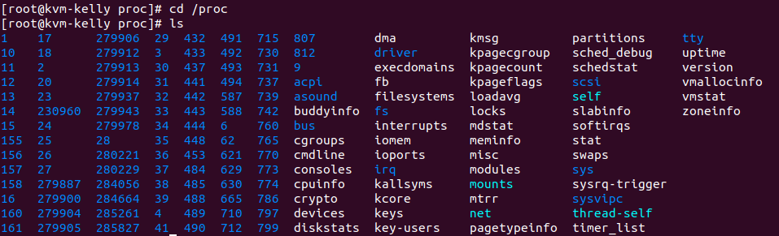
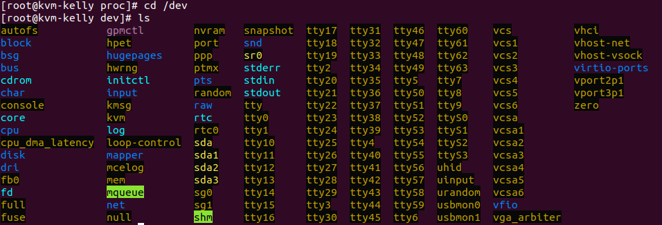

# Linux Filesystem Hierarchy

**References**:
- UaLSAH - Chapter 6 - The Filesystem
- TLCL - Chapter 3, Guided Tour

### Everything is a File

Unix tries to make everything a file:

- Processes are a file - `/proc/###`
  - Not actual file and directories on the system
  - A glimpse into the brain of the kernel
- Devices are a file - `/dev` - (**b**lock or **c**haracter and Major and Minor numbers)
  - `/dev/sda` and `/dev/sda1`
    - 'sd' - seta disk - '1' the first partition
  - `/dev/lp0`
  - `/dev/input/mouse0` - connection for mouse
  - `/dev/null` - dumping ground for output that does not want to see
  - `/dev/random` - used for random input
  
A description and comparison to where Microsoft Windows stores things and where Mac OS X stores things may be helpful.

- MS-DOS and Windows
  - Usually first disk is seen as drive `C`
  - `A` and `B` would be floppy disks
  - `D` could be a number of things
  - not really a naming convention to tell you whats going on
- Mac OS X
  - Mostly like UNIX/Linux
    - but, Mac hides stuff in the GUI (finder simplifies things)
    - terminal will show these

#### Processes /proc

Every time a program runs, it is assigned a process id, or a PID, number in the `/proc/` directory.

- blue numbers is a 'directory', and inside and file containing info about the process
  - again, not actually on the filesystem
  

#### Devices /dev

- devices represented as files
- black background represents devices

`r newLine()`
`r newLine()`

**Terminal output for /dev directory**

<pre>
$ cd /dev
$ ls -l
crw-r--r--. 1 root root     10, 235 Feb 10 18:49 autofs
drwxr-xr-x. 2 root root         140 Feb 10 18:49 block
drwxr-xr-x. 2 root root          80 Feb 10 18:49 bsg
drwxr-xr-x. 3 root root          60 Feb 10 18:49 bus
lrwxrwxrwx. 1 root root           3 Feb 10 18:49 cdrom -> sr0
drwxr-xr-x. 2 root root        2760 Feb 10 18:49 char
crw-------. 1 root root      5,   1 Feb 10 18:49 console
lrwxrwxrwx. 1 root root          11 Feb 10 18:49 core -> /proc/kcore
drwxr-xr-x. 4 root root          80 Feb 10 18:49 cpu
crw-------. 1 root root     10,  62 Feb 10 18:49 cpu_dma_latency
drwxr-xr-x. 7 root root         140 Feb 10 18:49 disk
drwxr-xr-x. 3 root root          80 Feb 10 18:49 dri
crw-rw----. 1 root video    29,   0 Feb 10 18:49 fb0
lrwxrwxrwx. 1 root root          13 Feb 10 18:49 fd -> /proc/self/fd
crw-rw-rw-. 1 root root      1,   7 Feb 10 18:49 full
crw-rw-rw-. 1 root root     10, 229 Feb 10 18:49 fuse
srwxrwxrwx. 1 root root           0 Feb 10 18:49 gpmctl
crw-------. 1 root root     10, 228 Feb 10 18:49 hpet
drwxr-xr-x. 2 root root           0 Feb 10 18:49 hugepages
crw-------. 1 root root     10, 183 Feb 10 18:49 hwrng
lrwxrwxrwx. 1 root root          12 Feb 10 18:49 initctl -> /run/initctl
drwxr-xr-x. 3 root root         220 Feb 10 18:49 input
crw-r--r--. 1 root root      1,  11 Feb 10 18:49 kmsg
crw-rw-rw-. 1 root kvm      10, 232 Feb 10 18:49 kvm
lrwxrwxrwx. 1 root root          28 Feb 10 18:49 log -> /run/systemd/journal/dev-log
crw-rw----. 1 root disk     10, 237 Feb 10 18:49 loop-control
drwxr-xr-x. 2 root root          60 Feb 10 18:49 mapper
crw-------. 1 root root     10, 227 Feb 10 18:49 mcelog
crw-r-----. 1 root kmem      1,   1 Feb 10 18:49 mem
drwxrwxrwt. 2 root root          40 Feb 10 18:49 mqueue
drwxr-xr-x. 2 root root          60 Feb 10 18:49 net
crw-rw-rw-. 1 root root      1,   3 Feb 10 18:49 null
crw-------. 1 root root     10, 144 Feb 10 18:49 nvram
crw-r-----. 1 root kmem      1,   4 Feb 10 18:49 port
crw-------. 1 root root    108,   0 Feb 10 18:49 ppp
crw-rw-rw-. 1 root tty       5,   2 Feb 12 14:26 ptmx
drwxr-xr-x. 2 root root           0 Feb 10 18:49 pts
crw-rw-rw-. 1 root root      1,   8 Feb 10 18:49 random
drwxr-xr-x. 2 root root          60 Feb 10 18:49 raw
lrwxrwxrwx. 1 root root           4 Feb 10 18:49 rtc -> rtc0
crw-------. 1 root root    251,   0 Feb 10 18:49 rtc0
brw-rw----. 1 root disk      8,   0 Feb 10 18:49 sda
brw-rw----. 1 root disk      8,   1 Feb 10 18:49 sda1
brw-rw----. 1 root disk      8,   2 Feb 10 18:49 sda2
brw-rw----. 1 root disk      8,   3 Feb 10 18:49 sda3
crw-rw----. 1 root disk     21,   0 Feb 10 18:49 sg0
crw-rw----. 1 root cdrom    21,   1 Feb 10 18:49 sg1
drwxrwxrwt. 2 root root          40 Feb 10 18:49 shm
crw-------. 1 root root     10, 231 Feb 10 18:49 snapshot
drwxr-xr-x. 3 root root         240 Feb 10 18:49 snd
brw-rw----. 1 root cdrom    11,   0 Feb 10 18:49 sr0
lrwxrwxrwx. 1 root root          15 Feb 10 18:49 stderr -> /proc/self/fd/2
lrwxrwxrwx. 1 root root          15 Feb 10 18:49 stdin -> /proc/self/fd/0
lrwxrwxrwx. 1 root root          15 Feb 10 18:49 stdout -> /proc/self/fd/1
crw-rw-rw-. 1 root tty       5,   0 Feb 12 13:25 tty
crw--w----. 1 root tty       4,   0 Feb 10 18:49 tty0
crw--w----. 1 root tty       4,   1 Feb 10 18:49 tty1
crw--w----. 1 root tty       4,  10 Feb 10 18:49 tty10
crw--w----. 1 root tty       4,  11 Feb 10 18:49 tty11
crw--w----. 1 root tty       4,  12 Feb 10 18:49 tty12
crw--w----. 1 root tty       4,  13 Feb 10 18:49 tty13
crw--w----. 1 root tty       4,  14 Feb 10 18:49 tty14
crw--w----. 1 root tty       4,  15 Feb 10 18:49 tty15
crw--w----. 1 root tty       4,  16 Feb 10 18:49 tty16
crw--w----. 1 root tty       4,  17 Feb 10 18:49 tty17
crw--w----. 1 root tty       4,  18 Feb 10 18:49 tty18
crw--w----. 1 root tty       4,  19 Feb 10 18:49 tty19
crw--w----. 1 root tty       4,   2 Feb 10 18:49 tty2
crw--w----. 1 root tty       4,  20 Feb 10 18:49 tty20
crw--w----. 1 root tty       4,  21 Feb 10 18:49 tty21
crw--w----. 1 root tty       4,  22 Feb 10 18:49 tty22
crw--w----. 1 root tty       4,  23 Feb 10 18:49 tty23
crw--w----. 1 root tty       4,  24 Feb 10 18:49 tty24
crw--w----. 1 root tty       4,  25 Feb 10 18:49 tty25
crw--w----. 1 root tty       4,  26 Feb 10 18:49 tty26
crw--w----. 1 root tty       4,  27 Feb 10 18:49 tty27
crw--w----. 1 root tty       4,  28 Feb 10 18:49 tty28
crw--w----. 1 root tty       4,  29 Feb 10 18:49 tty29
crw--w----. 1 root tty       4,   3 Feb 10 18:49 tty3
crw--w----. 1 root tty       4,  30 Feb 10 18:49 tty30
crw--w----. 1 root tty       4,  31 Feb 10 18:49 tty31
crw--w----. 1 root tty       4,  32 Feb 10 18:49 tty32
crw--w----. 1 root tty       4,  33 Feb 10 18:49 tty33
crw--w----. 1 root tty       4,  34 Feb 10 18:49 tty34
crw--w----. 1 root tty       4,  35 Feb 10 18:49 tty35
crw--w----. 1 root tty       4,  36 Feb 10 18:49 tty36
crw--w----. 1 root tty       4,  37 Feb 10 18:49 tty37
crw--w----. 1 root tty       4,  38 Feb 10 18:49 tty38
crw--w----. 1 root tty       4,  39 Feb 10 18:49 tty39
crw--w----. 1 root tty       4,   4 Feb 10 18:49 tty4
crw--w----. 1 root tty       4,  40 Feb 10 18:49 tty40
crw--w----. 1 root tty       4,  41 Feb 10 18:49 tty41
crw--w----. 1 root tty       4,  42 Feb 10 18:49 tty42
crw--w----. 1 root tty       4,  43 Feb 10 18:49 tty43
crw--w----. 1 root tty       4,  44 Feb 10 18:49 tty44
crw--w----. 1 root tty       4,  45 Feb 10 18:49 tty45
crw--w----. 1 root tty       4,  46 Feb 10 18:49 tty46
crw--w----. 1 root tty       4,  47 Feb 10 18:49 tty47
crw--w----. 1 root tty       4,  48 Feb 10 18:49 tty48
crw--w----. 1 root tty       4,  49 Feb 10 18:49 tty49
crw--w----. 1 root tty       4,   5 Feb 10 18:49 tty5
crw--w----. 1 root tty       4,  50 Feb 10 18:49 tty50
crw--w----. 1 root tty       4,  51 Feb 10 18:49 tty51
crw--w----. 1 root tty       4,  52 Feb 10 18:49 tty52
crw--w----. 1 root tty       4,  53 Feb 10 18:49 tty53
crw--w----. 1 root tty       4,  54 Feb 10 18:49 tty54
crw--w----. 1 root tty       4,  55 Feb 10 18:49 tty55
crw--w----. 1 root tty       4,  56 Feb 10 18:49 tty56
crw--w----. 1 root tty       4,  57 Feb 10 18:49 tty57
crw--w----. 1 root tty       4,  58 Feb 10 18:49 tty58
crw--w----. 1 root tty       4,  59 Feb 10 18:49 tty59
crw--w----. 1 root tty       4,   6 Feb 10 18:49 tty6
crw--w----. 1 root tty       4,  60 Feb 10 18:49 tty60
crw--w----. 1 root tty       4,  61 Feb 10 18:49 tty61
crw--w----. 1 root tty       4,  62 Feb 10 18:49 tty62
crw--w----. 1 root tty       4,  63 Feb 10 18:49 tty63
crw--w----. 1 root tty       4,   7 Feb 10 18:49 tty7
crw--w----. 1 root tty       4,   8 Feb 10 18:49 tty8
crw--w----. 1 root tty       4,   9 Feb 10 18:49 tty9
crw-rw----. 1 root dialout   4,  64 Feb 10 18:49 ttyS0
crw-rw----. 1 root dialout   4,  65 Feb 10 18:49 ttyS1
crw-rw----. 1 root dialout   4,  66 Feb 10 18:49 ttyS2
crw-rw----. 1 root dialout   4,  67 Feb 10 18:49 ttyS3
crw-------. 1 root root     10, 239 Feb 10 18:49 uhid
crw-------. 1 root root     10, 223 Feb 10 18:49 uinput
crw-rw-rw-. 1 root root      1,   9 Feb 10 18:49 urandom
crw-------. 1 root root    246,   0 Feb 10 18:49 usbmon0
crw-------. 1 root root    246,   1 Feb 10 18:49 usbmon1
crw-rw----. 1 root tty       7,   0 Feb 10 18:49 vcs
crw-rw----. 1 root tty       7,   1 Feb 10 18:49 vcs1
crw-rw----. 1 root tty       7,   2 Feb 10 18:49 vcs2
crw-rw----. 1 root tty       7,   3 Feb 10 18:49 vcs3
crw-rw----. 1 root tty       7,   4 Feb 10 18:49 vcs4
crw-rw----. 1 root tty       7,   5 Feb 10 18:49 vcs5
crw-rw----. 1 root tty       7,   6 Feb 10 18:49 vcs6
crw-rw----. 1 root tty       7, 128 Feb 10 18:49 vcsa
crw-rw----. 1 root tty       7, 129 Feb 10 18:49 vcsa1
crw-rw----. 1 root tty       7, 130 Feb 10 18:49 vcsa2
crw-rw----. 1 root tty       7, 131 Feb 10 18:49 vcsa3
crw-rw----. 1 root tty       7, 132 Feb 10 18:49 vcsa4
crw-rw----. 1 root tty       7, 133 Feb 10 18:49 vcsa5
crw-rw----. 1 root tty       7, 134 Feb 10 18:49 vcsa6
drwxr-xr-x. 2 root root          60 Feb 10 18:49 vfio
crw-------. 1 root root     10,  63 Feb 10 18:49 vga_arbiter
crw-------. 1 root root     10, 137 Feb 10 18:49 vhci
crw-------. 1 root root     10, 238 Feb 10 18:49 vhost-net
crw-------. 1 root root     10, 241 Feb 10 18:49 vhost-vsock
drwxr-xr-x. 2 root root          80 Feb 10 18:49 virtio-ports
crw-------. 1 root root    244,   1 Feb 10 18:49 vport2p1
crw-------. 1 root root    243,   1 Feb 10 18:49 vport3p1
crw-rw-rw-. 1 root root      1,   5 Feb 10 18:49 zero
</pre>

`r newLine()`
`r newLine()`

Note: Using the following line `brw-rw----. 1 root disk      8,   1 Feb 10 18:49 sda1`

- the column the typically represents size, now indicated the *major* and *minor* number.
  - In the line above - `8,   1`
    - 8 - major number
    - 1 - minor number
- block or character device
  - The beginning of the line above begins with `brw-rw----.`. The **b** means block devices. Whereas a **c** would indicate a character device. 

#### Linux filesystem hierarchy** (UaLSAH pg 145 - 147 also man hier)

- `/` (different that /root) - top level directory
- `/bin` - Most rudimentary binaries
- `/boot` - Kernel, driver disk images, bootloader config
- `/dev` - character, block, major / minor
- `/etc` - Global config files
- `/home` - Users' directories - dot files and dot folders for configs
- `/lib` - Most rudimentary libraries and firmware
- `/lost+found` - Where damaged files go after fsck (filesystem check)
- `/media` - Where removable media is often automounted
  - `/run` is another place desktop environments use
- `/mnt` - Like media (typically for manually mounting longer term removable media)
- `/opt` - Optional third-party software
- `/proc` - A glimpse inside the brain of the kernel
- `/root` - The root user's home directory
- `/run` - companion to `/var/run` - used by services like *systmd*
   - typically where devices such optical drives are mounted
- `/sbin` - Most rudimentary super user binaries
- `/srv` - place for services to store data
  - services like a web server or database server
- `/sys` - Augments `/proc`
  - different way for APIs to access certain data
- `/tmp` - World writable, temporary storage
- `/usr` - Large hierarchy - most user programs, hierarchy for user prog support
  - bin, include, lib, local, sbin, share, src
  - (*Mostly static content*)
- `/var` - Large hierarchy - place for variable services data, logs, etc.
  - lib, lib/mysql, local, lock, log, run, spool, www
  - (*Mostly variable content*)

**References**:

- http://tldp.org/LDP/Linux-Filesystem-Hierarchy/html/
- http://en.wikipedia.org/wiki/Unix_directory_structure
- http://fedoraproject.org/wiki/Features/UsrMove (adopted by many distros)

#### SysAdmins work in /etc

**Interesting files in /etc**:

- fstab - Defines default mount points (man fstab)
- inittab - Defines default runlevel
- passwd, group, shadow, gshadow (covered in User Accounts lecture)
  - very restricted (can store encrypted passwords)
- systemd/ - systemd related configs
- profile, bashrc - Defines the environment by setting env variables
- bash_completion.d/ - Additional tab completion for bash-completion package
- resolv.conf - Specifies the DNS servers (man resolv.conf)
  - configure host on waht DNS servers to talk to
  - 
- services - Shows port defs (man services)
  - maps port numbers to common services
- hosts - Local DNS type defs (man hosts)
  - like a phonebook for hosts
- nsswitch.conf - Lookup order of DNS and other things (man 5 nsswitch.conf)
- hostname
  - `$ cat /etc/hostname` - will give the hostname of the computer
  - (hostname-ctl set-hostname kvm-dowdle.localdomain)
    - allows you to edit/set the hostname

*Individual user settings are in "dot directories and dot files" inside each user's home directory. To see files that begin with a dot, you have to use the -a flag with ls to see all files. If using a GUI file manager, look for a reference to "hidden" or show hidden.*

