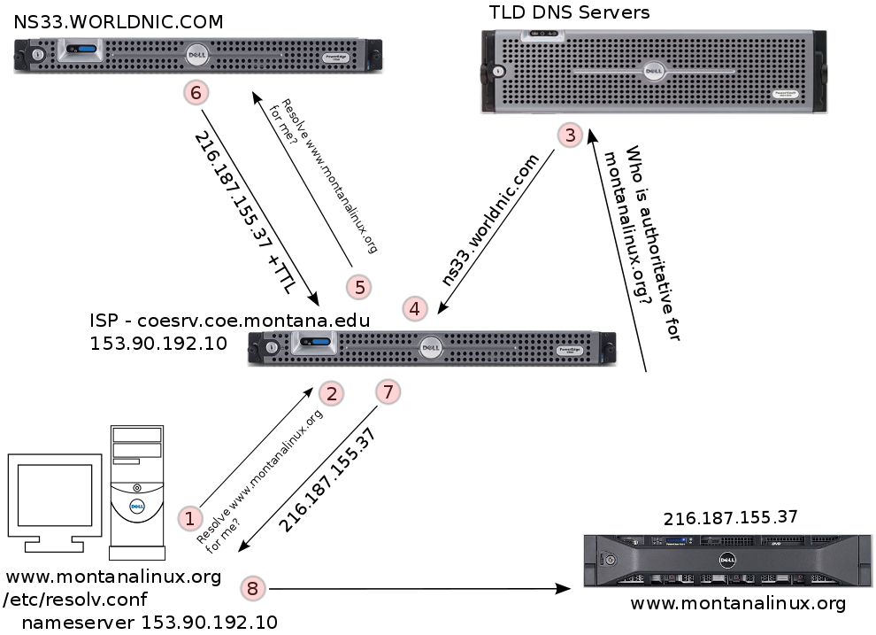

# Network Configuration

__Screencast__: [16-networking.webm](https://www.cs.montana.edu/users/sdowdle/csci351/videos/16-networking.webm) or [16-networking.mp4](https://www.cs.montana.edu/users/sdowdle/csci351/videos/16-networking.mp4)

- LaUSAH REFERENCE - Chapter 14, TCP/IP Networking
- RHEL8 Configuring and Managing Networking Guide (PDF)

__Originals__: [PDF](16/Network Configuration.pdf) - [HTML](16/Thursday - 18FEB - Network Configuration.html)


> Please __DO NOT__ edit nor attempt to alter the network configuration of your student KVM VM.


## What network card do I have?

lspci is provided by the pciutils package

```bash
$ lspci | grep -i net # will work in KVM VM [or physical machine]
00:03.0 Ethernet controller: Red Hat, Inc Virtio network device
```


## Network basics

To configure the network on a computer you usually need to know a few pieces of information:

- IP address
- Default gateway
- Network mask
- DNS

If your network uses DHCP (Dynamic Host Configuration Protocol) you can use a dhcp client application and have your computer get all of the needed network settings from the DHCP server.

## Tools to configure the network

- nmcli - https://www.youtube.com/watch?v=6xfSUdxeasA
- nmtui - https://www.youtube.com/watch?v=E7gWVZrZbUY
- nm gui - https://www.youtube.com/watch?v=QJd3AJW05Aw (applets for KDE and GNOME)

__Lower Level Tools__: ip, ifconfig


## How to set the system hostname

```bash
$ hostnamectl set-hostname {host.domain.tld}
```

```bash
$ hostnamectl set-hostname kvm-dowdle.localdomain
```

> What package provides it? - new-tools


## Example configurations

    
    [root@csci351 ~]# cat /etc/sysconfig/network-scripts/ifcfg-ens18
    TYPE=Ethernet
    PROXY_METHOD=none
    BROWSER_ONLY=no
    BOOTPROTO=none
    DEFROUTE=yes
    IPV4_FAILURE_FATAL=yes
    IPV6INIT=yes
    IPV6_AUTOCONF=no
    IPV6_DEFROUTE=yes
    IPV6_FAILURE_FATAL=no
    IPV6_ADDR_GEN_MODE=stable-privacy
    NAME=ens18
    UUID=a28f5b2c-99b4-454c-b3f4-0e3efb89baeb
    DEVICE=ens18
    ONBOOT=yes
    IPADDR=153.90.127.176
    PREFIX=24
    GATEWAY=153.90.127.254
    DNS1=153.90.2.1
    DNS2=153.90.2.15
    DOMAIN="cs.montana.edu msu.montana.edu coe.montana.edu"
    IPV6_PRIVACY=no


- Please note that `/etc/hosts` is a special file in that it can be used as a sort of "local DNS".
- `/etc/hosts` is usually consulted before the specified nameservers and `/etc/hosts` can be used to override DNS lookups if desired. 

`/etc/hosts` sample contents:
     
    [dowdle@csci351 ~]$ cat /etc/hosts
    (examine the output... short excerpt below)
    192.168.122.101         kvm-101.localdomain     kvm-101         kvm-alghamdi
    192.168.122.102         kvm-102.localdomain     kvm-102         kvm-alvarez
    192.168.122.103         kvm-103.localdomain     kvm-103         kvm-arstein
       [...]
    92.168.122.157          kvm-157.localdomain     kvm-157         kvm-wilkerson
    192.168.122.158         kvm-158.localdomain     kvm-158         kvm-wintersteen
    192.168.122.159         kvm-159.localdomain     kvm-159         kvm-zetterberg


_DNS configuration_ is stored in `/etc/resolv.conf`. Where we define in a system who we talk to in DNS.


Here is an example `/etc/resolv.conf`:
     
    [sdowdle@csci351 ~]$ cat /etc/resolv.conf
    # Generated by NetworkManager
    search cs.montana.edu msu.montana.edu coe.montana.edu
    nameserver 153.90.2.1
    nameserver 153.90.2.15

How does DNS work anyway?

 
## DNS Related Commands
 
The `/usr/bin/host` command is part of the __bind-utils__ package. Example:
 
    host www.cs.montana.edu
    host 153.90.127.197
 
The `/usr/bin/dig` command is part of the __bind-utils__ package.  Example:
 
    dig MX cs.montana.edu # (shows Mail eXchange record)
    dig NS cs.montana.edu # (shows NameServer record)
 
The `/usr/bin/nslookup` command is part of the __bind-utils__ package.  Example:
 
    nslookup www.cs.montana.edu

`nslookup` interactively:

    $ nslookup
    > server 8.8.8.8
    Default server: 8.8.8.8
    Address: 8.8.8.8#53
    > www.montanalinux.org
    Server: 8.8.8.8
    Address: 8.8.8.8#53
    
    Non-authoritative answer:
    Name: www.montanalinux.org
    Address: 69.60.124.50
    > exit
 
The `/usr/bin/whois` command is part of the __whois__ package.
Unfortunately, much of the info is no longer shown these days and the usefulness of the command has diminished.

Example:
    
    [dowdle@csci351 ~]$ whois montanalinux.org
     whois montanalinux.org
    [Querying whois.pir.org]
    [whois.pir.org]
    Domain Name: MONTANALINUX.ORG
    Domain ID: D33213288-LROR
    WHOIS Server:
    Referral URL: http://www.networksolutions.com
    Updated Date: 2012-08-03T21:30:52Z
    Creation Date: 2000-08-18T21:48:24Z
    Registry Expiry Date: 2017-08-18T21:48:24Z
    Sponsoring Registrar: Network Solutions, LLC
    Sponsoring Registrar IANA ID: 2
    Domain Status: clientTransferProhibited https://www.icann.org/epp#clientTransferProhibited
    Registrant ID: 5991102-NSI
    Registrant Name: SCOTT DOWDLE
    Registrant Organization:
    Registrant Street: 704 Church Street
    Registrant City: Belgrade
    Registrant State/Province: MT
    Registrant Postal Code: 59714
    Registrant Country: US
    Registrant Phone: +1.4063880827
    Registrant Phone Ext:
    Registrant Fax:
    Registrant Fax Ext:
    Registrant Email: dowdle@montanalinux.org
    Admin ID: 5991102-NSI
    Admin Name: SCOTT DOWDLE
    Admin Organization:
    Admin Street: 704 Church Street
    Admin City: Belgrade
    Admin State/Province: MT
    Admin Postal Code: 59714
    Admin Country: US
    Admin Phone: +1.4063880827
    Admin Phone Ext:
    Admin Fax:
    Admin Fax Ext:
    Admin Email: dowdle@montanalinux.org
    Tech ID: 5991102-NSI
    Tech Name: SCOTT DOWDLE
    Tech Organization:
    Tech Street: 704 Church Street
    Tech City: Belgrade
    Tech State/Province: MT
    Tech Postal Code: 59714
    Tech Country: US
    Tech Phone: +1.4063880827
    Tech Phone Ext:
    Tech Fax:
    Tech Fax Ext:
    Tech Email: dowdle@montanalinux.org
    Name Server: NS33.WORLDNIC.COM
    Name Server: NS34.WORLDNIC.COM
    DNSSEC: unsigned
    >>> Last update of WHOIS database: 2016-02-23T17:08:12Z <<<

