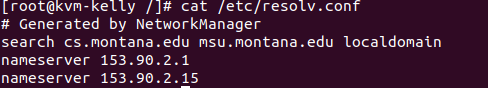

# Week 1: January 10-16 {#wk-1}

- [Introduction](#wk-1-1)
- [History - Unix, Free Software and Linux](#wk-1-2)
- [What is a Linux Distribution?](#wk-1-3)
- [What is a System Administrator?](#wk-1-4)

**Videos**

- [Revolution OS HD](https://youtu.be/4vW62KqKJ5A)

## Introduction {#wk-1-1}


**Screencast**: 
[01-introduction.webm](https://www.cs.montana.edu/users/sdowdle/csci351/videos/01-introduction.webm){target="_blank"} 
or 
[01-introduction.mp4](https://www.cs.montana.edu/users/sdowdle/csci351/videos/01-introduction.mp4){target="_blank"}

All lectures for this class will be available in the [webm](https://en.wikipedia.org/wiki/Webm) and or mp4 formats which should play fine with the Firefox and Google Chrome web browsers.  Feel free to right-click on any video link and download it to play with your preferred video player.  [VLC](https://www.videolan.org/) is recommended.

==========================

### About Scott Dowdle

- CS System Administrator since August 2005 (Now embedded NACOEIT under the UIT)
- System Administrator for Rocky Mountain College from 2000 - 2005
- Montana Communications Network - 1998 - 2000
- Linux user since January of 1995

### Brightspace LE (formerly D2L, Desire 2 Learn)

While this is a "Blended" course all of the material will be made available via Brightspace to provide text resources, homework assignments. quizzes, the mid-term and final exam.  Having all of the content available online is not new / just because of the COVID19 pandemic.  I have been putting my materials online for years and it is a format that has worked well according to the course / instructor surveys.  In the past I preferred paper measurement (quizzes, mid-term, final) but now those are in Brightspace too.  Please note that I **DO NOT** use the Brightspace gradebook.  Homework feedback and grade will be provided to you via a text file on your student virtual machine... which will encourage more ssh / shell usage.

### Course and Student Virtual Machines

There is a **course server** for the class (**csci351.cs.montana.edu**) which has a **public IP** address and is accessible via ssh.  You will need an ssh client to access the course server and there are several to pick from for Microsoft Windows, macOS, and Linux.  Students can access the course server with their netid account.  To access via campus wifi, you should be on the [MSU Secure](http://www.montana.edu/wifi/) network.  If you have unresolvable issues with and can't connect to the MSU Secure network, MSU Guest may be used in conjunction with the [MSU VPN](http://www.montana.edu/uit/computing/desktop/vpn/index.html) client.  The course server is accessible from off-campus without requiring a VPN connection.

Each student will be assigned a **student KVM virtual machine** (CentOS 8) of their own to do task-oriented homework assignments. Each student virtual machine will have a non-routable, **private IP** address which is accessible via ssh from the course server.  Initially there is only the root account but in homework 1, students will create a user account for themselves.


### CSCI 351 Topics (see Calendar PDF for specific weeks/dates)

- History - Unix, Free Software and Linux
- What is a Linux Distribution?
- What is a System Administrator?
- OS Installation and System Updates
- CLI use: bash, hot keys, job control
- Users accounts
- Hard disks, partitions, and file systems
- Linux file system hierarchy
- Commandline Potpourri
- Understanding file/dir ownership and permissions
- Package managers
- Processes and Process Management
- systemd and Service Management
- Backups
- Desktop Linux
- Network Configuration
- Printing with CUPS
- Firewalls & iptables
- System logs and Monitoring
- Automation with cron
- Server apps: Email
- Server apps: Apache
- Server apps: MariaDB
- Server apps: DNS
- Virtualization Introduction
- KVM
- System Containers (LXC)
- Application Containers (podman)
- VDI

*Please note that while there are two topics specifically dedicated to the command line and various command line tools (CLI use, Command Line Potpourri), continued learning and practice throughout the entire semester is required.  Each week one or two chapters out of The Linux Command Line book will be assigned in addition to the topics mentioned above.*

### Course Resources

- Lab machines (Barnard 254, any MSU Global Student Lab, etc)
- Course and Student VMs
- Student laptops and home machines (optional)


## History - Unix, Free Software and Linux {#wk-1-2}


**Screencast**:: 
[02-history.webm](https://www.cs.montana.edu/users/sdowdle/csci351/videos/02-history.webm){target="_blank"} 
or 
[02-history.mp4](https://www.cs.montana.edu/users/sdowdle/csci351/videos/02-history.mp4){target="_blank"}

### In the Beginning

- Room size computers with vacuum tubes
- No operating systems
- All software was custom
- Virtually no commercial software
- Community of sharing

### The Industry Evolves

- Eventually hardware vendors provided operating environments
- Every make / model had its own OS
- Portable programming languages start to appear

### Birth of UNIX at AT&T Bell Labs (1969)

- Multics committee (multi-company)
- Dennis Ritchie, Ken Thompson and Brian Kernighan
- C begat UNIX which begat C
- US FTC anti-trust investigation
- UNIX at Uni
- Legitimized Computer Science
- AT&T broken up into "Baby Bells"
- Bell Labs and UNIX commercialization

### [Richard Stallman](https://en.wikipedia.org/wiki/Richard_Stallman) (RMS)

- MIT Artificial Intelligence Laboratory
- ITS OS (Incompatible Timesharing System)
- Lost co-workers to vendor UNIXes
- Mad at printer makers
- GNU Project (Sep. 1983)
- "GNU's Not UNIX"
- GNU Manifesto (1985)
- Free Software Foundation (FSF)
- GNU Public License (GPL)


### Berkeley Software Distribution (BSD)

- Bill Joy at USC Berkeley
- BSD originally a remixed UNIX
- Became its own thing
- BSDi sued by USL in 1992

### [Andrew S. Tanenbaum](https://en.wikipedia.org/wiki/Andrew_S._Tanenbaum) (AST)

- MIT in the 60's
- Physics and Astrophysics
- Moved to Netherlands, VU University Amsterdam
- Several CS Textbooks
- Minix (Prentice Hall)

### [Linus Torvalds](https://en.wikipedia.org/wiki/Linus_torvalds)

- University of Helsinki (1988-96)
- Wanted to make his own UNIX
- Bootstrapped it with Minix
- Wanted to call it Freax
- Announced Linux ~1991

### Why [Red Hat](https://www.redhat.com/en) Enterprise Linux?

- They contribute to the community / ecosystem a lot
- No really!
- Often top contributor to each Linux kernel
- Owns Cygnus (Cygwin) and many others
- Contributes to many, many ecosystems projects
- https://www.redhat.com/en/about/open-source-program-office/contributions
 
### Why [CentOS](https://www.centos.org/)?

- Free (as in beer and freedom) clone of RHEL
- Sponsored by Red Hat
- Also clones most of Red Hat’s other projects
- My server distro of choice

### Why [Fedora](https://getfedora.org/)?

- Upstream of RHEL
- Sponsored by Red Hat
- Four F's (Freedom, Friends, Features, First [Firehose of updates])
- My desktop distro of choice

### Open Source (Open Source Inititive)

- Open Source vs Free Software
  - Free Software (Free Software Foundation)
    - Free as in Freedom
    - CAN charge for it
    - Ensures the Four Freedoms
      - Use
      - Examine
      - Redistribute
      - Modify
  - Open Source (Open Source Inititive)
    - A development model
    - More business oriented

### Things to Ponder

- Using proprietary software is like having a car with the hood welded shut
- FOSS (Free and Open Source Software) is like an insurance policy
- Which is more free?  The GPL or the BSD license?`r newLine()`Depends on who you ask

### TLCL book put it like this:

> *Many people speak of “freedom” with regard to Linux, but I don't think most people know what this freedom really means. Freedom is the power to decide what your computer does, and the only way to have this freedom is to know what your computer is doing. Freedom is a computer that is without secrets, one where everything can be known if you care enough to find out.`r newLine()`(Introduction page xvi)*

### REFERENCES:

- A Quarter Century of UNIX by Peter H. Salus (1994)
- The Daemon, the GNU & the Penguin also by Dr. Salus (2006)


## What is a Linux Distribution? {#wk-1-3}


**Screencast**: 
[03-distros.webm](https://www.cs.montana.edu/users/sdowdle/csci351/videos/03-distros.webm) 
or 
[03-distros.mp4](https://www.cs.montana.edu/users/sdowdle/csci351/videos/03-distros.mp4)

A Linux distribution is the Linux kernel provided with a collection of additional software such that it can be booted on a computer from optical media, floppy disk, USB thumbdrive, etc... and is most often installable to permanent storage. A distribution may or may not provide periodic software updates to fix software bugs and remedy security problems.

There are **over 500** different Linux distributions. Why do so many exist?

Most of them inherit from one of the major distros:

- Debian
- Slackware
- Red Hat

So many exist for a number of reasons:

- The source is there and the license lets you roll your own
- Localization - Country/Language specific
- Specific CPU arch - PPC, Alpha, ARM, SPARC, etc
- Specific devices - Linksys router, Raspberry Pi, ODROID, Android devices, etc
- Specific storage - Floppy, CD, Zip disk, small HD, diskless terminal, etc
- Specific software - Desktop env, special software or configuration, etc
- Specific use case - KVM virtualization host, Container host, Python Programming, Gaming, etc
- Educational - Linux from Scratch

How does one Linux distribution differ from another:

- Installer
- Software available (desktop spins)
- Administration tools (GUI, TUI, CLI)
- Init system (SysV init, upstart, OpenRC, systemd)
- Developers and community / Company
- 95% of the same software

Why does Scott like Red Hat and Fedora?

See: [Is Red Hat still relevant? You bet.](http://www.montanalinux.org/redhat-relevent.html)

What about Ubuntu or other distributions?

Resources:

- Linux Weekly News' [Distributions](http://lwn.net/Distributions/) page
- [DistroWatch](http://www.distrowatch.com/)


## What is a System Administrator? {#wk-1-4}

:::: {.original-sources-con}
**Original Sources**: [PDF](01/assets/Thursday - 14JAN - What is a System Administrator_ - Systems Administration.pdf) - [HTML](01/assets/systems-administration.html)
::::

**Screencast**: 
[04-sysadmin.webm](https://www.cs.montana.edu/users/sdowdle/csci351/videos/04-sysadmin.webm) 
or 
[04-sysadmin.mp4](https://www.cs.montana.edu/users/sdowdle/csci351/videos/04-sysadmin.mp4)

#### What exactly is a "System Administrator"?

System administration is a very broad topic and depending on a particular job or company it can range from being a "jack of all trades but master of none" to being very specialized. This course is going to attempt to give as broad a base of sysadmin information / experience as possible without being able to delve too deeply into any particular topic.

Specialized types:

- Web server - Often referred to as webmaster
- Database - Often referred to as DBA
  - Oracle
  - MySQL
  - PostgreSQL
- Email - Often referred to as postmaster
- Network Administrator
- Security
- Storage Management
- Virtualization
- Any other server application you can think of working with End Users

A System Administrator, whether warranted or not, often has a reputation for not being a "people person". They are often seen as grumpy, lazy and someone who speaks a language all their own... filled with technical jargon that non-computer types don't understand.

- End users don't usually formulate their questions very well.
- End users are often uncomfortable talking to a system administrator and feel as they will be perceived as being stupid or negligent.
- They often have misinformation or a bad understanding of how something works.
- It is up to you to ask questions before you start providing answers so you can make sure you understand what they really need / want. It is often useful to back up from a problem or request and try to see the bigger picture.
- Try your best to educate your users and show them how to collect troubleshooting information so they can become partners rather than adversaries.
- After a few positive experiences some of your users may end up becoming "assistant administrators" because you have educated them where they may be able to help others.
- Try to find multiple solutions rather than just the simplest and if appropriate, let the end user choose which one is better for them.
- End users often have good ideas. Make sure to acknowledge them and try to apply them where appropriate.
- Having a good relationship with your customers will always make your job easier.
- Don't be afraid to say you don't know something and that you'll have to do some research.
- Make sure to follow through to completion in a timely fashion and do follow-up calls / visits to ensure a solution is working.
- Recognize when you need to create documentation for yourself and your users. Use FAQs or SOPs. Provide your users with as much documentation as they are comfortable with.
- Try to track problems and recognize trends with users, software, and hardware.


# Week 2: January 17-23 {#wk-2}

#### Videos

- [Triumph of the Nerds: Part 1: Impressing Their Friends](https://youtu.be/toSRmKKiosQ)
  - Here is a description borrowed from Wikipedia of the 3-part Triumph of the Nerds series from 1996:
  `r newLine()``r newLine()`
  It explores the development of the personal computer in the United States from WWII to 1995.
  `r newLine()``r newLine()`
  Triumph of the Nerds was written and hosted by Robert X. Cringely (Mark Stephens) and based on his 1992 book Accidental Empires. The documentary is composed of numerous interviews with important figures connected with the personal computer including Steve Jobs, Steve Wozniak, Bill Gates, Steve Ballmer, Paul Allen, Bill Atkinson, Andy Hertzfeld, Ed Roberts, and Larry Ellison. It also includes archival footage of Gary Kildall and commentary from Douglas Adams, the author of the science fiction series The Hitchhiker's Guide to the Galaxy.
  `r newLine()``r newLine()`
  Triumph of the Nerds was produced by Oregon Public Broadcasting.  The video quality isn't the greatest but it is definitely viewable. It is approximately 50 minutes.


## Installing Linux

Part of being a Systems Administrator is installing and updating systems.

### Types of Media

- Minimal / network-based
	- Write out to a physical dick (CD ROM, thumb drive)
	- Write ISO from the distributions
- Live Media (Try before you buy)
	- Typically get a full desktop environment
- Install only Media
	- Not the full desktop env.
- Live Environment for manual installs

**4 different Linux distros**

1. CentOS boot (install only media)
2. CentOS DVD (install only media)
3. Xubuntu Desktop (live media)
4. MontanaLinux F33 XFCE (live media)

**Common Install Tasks**

- Select Language
- Select Timezone / NTP
- Partition and define mount points (including swap)
- Select Software
- Create User (with admin privs)
- Set root password

### Xubuntu (Live Media Install)


# Week 3: January 24-30 {#wk-3}

**Videos**

- [Triumph of the Nerds - 2 of 3 - PT-BR](https://youtu.be/Ba4kdetNc_M)

## User Accounts

**References**: UNIX and LINUX Administration Handbook - Chapter 7 - Adding New Users

Related man pages

- man 5 passwd
- man 5 group
- man 5 shadow

### Related files (ensure the man-pages package is installed)

- `/etc/passwd`
- `/etc/shadow`
- `/etc/group`
- `/etc/gshadow`
- `/etc/login.defs`
- `/etc/security/limits.conf` *(pam package)*
- `/etc/skel/` *(contains files/dirs copied to homedir of new accounts)*

#### /etc/passwd (man 5 passwd)

*Example*: dowdle:x:1000:1000:Scott Dowdle:/home/dowdle:/bin/bash

1. User name
2. Encrypted password, an *, or an x (see pwconv)
3. UID
4. GID
5. GECOS - See: Wikipedia [GECOS](http://en.wikipedia.org/wiki/Gecos_field) page
  - Comment Field
6. Home Directory
  - all Linux distros under the `/home/` directory
    - **POSSIBLE TEST QUESTION**
7. Default Shell


#### /etc/shadow (man 5 shadow)

**Example**: `dowdle:$1$vkI/ffyR$rSsCe9K.GsuK83.cWI:14277:0:99999:7:::`

1. User name
2. Encrypted password
3. Days since Jan 1, 1970 that password was last changed
4. Days before password may be changed
5. Days after which password must be changed
6. Days before password is to expire that user is warned
7. Days after password expires that account is disabled
8. Days since Jan 1, 1970 that account is disabled
9. A reserved field

See: Wikipedia page on [UNIX time](http://en.wikipedia.org/wiki/Unix_time)

#### /etc/group (man 5 group)

**Example**: `dowdle:x:1000:dowdle`

1. Group name
2. Encrypted password if used
3. GID
4. Comma separated user list


### Related Commands and Issues

- /usr/sbin/useradd
- /usr/sbin/adduser -> useradd
- /usr/bin/chfn (Let's users adjust the GECOS)
  - Lets users run `adduser` themselves
  - prompt user info fields
- /usr/sbin/usermod (usermod -aG wheel dowdle)
  - change values in pass or group
  - adding users to existing groups
- /usr/bin/passwd (What are the permissions on this file?)
  - man 1 psswd
  - passwd
- rpm -ql shadow-utils (shows package contents)
- /usr/bin/whoami
- /usr/bin/id


Adding a user

```bash
$ useradd scott
$ adduser mike
```
Set password
```bash
$ passwd scott
```


Add user to wheel group

```bash
$ usermod -aG wheel scott
```

As root, become a different user
```bash
su -l scott
```

### Escalating privileges

- sudo, sudo -i (users in wheel group, other distros may use sudo group)
- su, su -l (need to know the root password unless already root)

For example:

```bash
$ sudo <command>
```

or

```bash
$ sudo -i # logs into root user
```

*Everything mentioned above is for "local" accounts. If this were an advanced sysadmin class we'd cover various forms of centralized authentication like LDAP and NIS/YP as well as integration with systems like FreeIPA and Microsoft Active Directory. Many Linux distributions work well with centralized authentication systems. In the case of Red Hat-derived distributions, they offer authconfig, sssd, realmd and freeipa-client.*


## Linux filesystem hierarchy


**References**:
- UaLSAH - Chapter 6 - The Filesystem
- TLCL - Chapter 3, Guided Tour

### Everything is a File

Unix tries to make everything a file:

- Processes are a file - `/proc/###`
  - Not actual file and directories on the system
  - A glimpse into the brain of the kernel
- Devices are a file - `/dev` - (**b**lock or **c**haracter and Major and Minor numbers)
  - `/dev/sda` and `/dev/sda1`
    - 'sd' - seta disk - '1' the first partition
  - `/dev/lp0`
  - `/dev/input/mouse0` - connection for mouse
  - `/dev/null` - dumping ground for output that does not want to see
  - `/dev/random` - used for random input
  
A description and comparison to where Microsoft Windows stores things and where Mac OS X stores things may be helpful.

- MS-DOS and Windows
  - Usually first disk is seen as drive `C`
  - `A` and `B` would be floppy disks
  - `D` could be a number of things
  - not really a naming convention to tell you whats going on
- Mac OS X
  - Mostly like UNIX/Linux
    - but, Mac hides stuff in the GUI (finder simplifies things)
    - terminal will show these


#### Processes /proc

Every time a program runs, it is assigned a process id, or a PID, number in the `/proc/` directory.


- blue numbers is a 'directory', and inside and file containing info about the process
  - again, not actually on the filesystem
  

#### Devices /dev


- devices represented as files
- black background represents devices


`r newLine()`
`r newLine()`

<details>
<summary>**Terminal output for /dev directory**</summary>
<pre>
$ cd /dev
$ ls -l
crw-r--r--. 1 root root     10, 235 Feb 10 18:49 autofs
drwxr-xr-x. 2 root root         140 Feb 10 18:49 block
drwxr-xr-x. 2 root root          80 Feb 10 18:49 bsg
drwxr-xr-x. 3 root root          60 Feb 10 18:49 bus
lrwxrwxrwx. 1 root root           3 Feb 10 18:49 cdrom -> sr0
drwxr-xr-x. 2 root root        2760 Feb 10 18:49 char
crw-------. 1 root root      5,   1 Feb 10 18:49 console
lrwxrwxrwx. 1 root root          11 Feb 10 18:49 core -> /proc/kcore
drwxr-xr-x. 4 root root          80 Feb 10 18:49 cpu
crw-------. 1 root root     10,  62 Feb 10 18:49 cpu_dma_latency
drwxr-xr-x. 7 root root         140 Feb 10 18:49 disk
drwxr-xr-x. 3 root root          80 Feb 10 18:49 dri
crw-rw----. 1 root video    29,   0 Feb 10 18:49 fb0
lrwxrwxrwx. 1 root root          13 Feb 10 18:49 fd -> /proc/self/fd
crw-rw-rw-. 1 root root      1,   7 Feb 10 18:49 full
crw-rw-rw-. 1 root root     10, 229 Feb 10 18:49 fuse
srwxrwxrwx. 1 root root           0 Feb 10 18:49 gpmctl
crw-------. 1 root root     10, 228 Feb 10 18:49 hpet
drwxr-xr-x. 2 root root           0 Feb 10 18:49 hugepages
crw-------. 1 root root     10, 183 Feb 10 18:49 hwrng
lrwxrwxrwx. 1 root root          12 Feb 10 18:49 initctl -> /run/initctl
drwxr-xr-x. 3 root root         220 Feb 10 18:49 input
crw-r--r--. 1 root root      1,  11 Feb 10 18:49 kmsg
crw-rw-rw-. 1 root kvm      10, 232 Feb 10 18:49 kvm
lrwxrwxrwx. 1 root root          28 Feb 10 18:49 log -> /run/systemd/journal/dev-log
crw-rw----. 1 root disk     10, 237 Feb 10 18:49 loop-control
drwxr-xr-x. 2 root root          60 Feb 10 18:49 mapper
crw-------. 1 root root     10, 227 Feb 10 18:49 mcelog
crw-r-----. 1 root kmem      1,   1 Feb 10 18:49 mem
drwxrwxrwt. 2 root root          40 Feb 10 18:49 mqueue
drwxr-xr-x. 2 root root          60 Feb 10 18:49 net
crw-rw-rw-. 1 root root      1,   3 Feb 10 18:49 null
crw-------. 1 root root     10, 144 Feb 10 18:49 nvram
crw-r-----. 1 root kmem      1,   4 Feb 10 18:49 port
crw-------. 1 root root    108,   0 Feb 10 18:49 ppp
crw-rw-rw-. 1 root tty       5,   2 Feb 12 14:26 ptmx
drwxr-xr-x. 2 root root           0 Feb 10 18:49 pts
crw-rw-rw-. 1 root root      1,   8 Feb 10 18:49 random
drwxr-xr-x. 2 root root          60 Feb 10 18:49 raw
lrwxrwxrwx. 1 root root           4 Feb 10 18:49 rtc -> rtc0
crw-------. 1 root root    251,   0 Feb 10 18:49 rtc0
brw-rw----. 1 root disk      8,   0 Feb 10 18:49 sda
brw-rw----. 1 root disk      8,   1 Feb 10 18:49 sda1
brw-rw----. 1 root disk      8,   2 Feb 10 18:49 sda2
brw-rw----. 1 root disk      8,   3 Feb 10 18:49 sda3
crw-rw----. 1 root disk     21,   0 Feb 10 18:49 sg0
crw-rw----. 1 root cdrom    21,   1 Feb 10 18:49 sg1
drwxrwxrwt. 2 root root          40 Feb 10 18:49 shm
crw-------. 1 root root     10, 231 Feb 10 18:49 snapshot
drwxr-xr-x. 3 root root         240 Feb 10 18:49 snd
brw-rw----. 1 root cdrom    11,   0 Feb 10 18:49 sr0
lrwxrwxrwx. 1 root root          15 Feb 10 18:49 stderr -> /proc/self/fd/2
lrwxrwxrwx. 1 root root          15 Feb 10 18:49 stdin -> /proc/self/fd/0
lrwxrwxrwx. 1 root root          15 Feb 10 18:49 stdout -> /proc/self/fd/1
crw-rw-rw-. 1 root tty       5,   0 Feb 12 13:25 tty
crw--w----. 1 root tty       4,   0 Feb 10 18:49 tty0
crw--w----. 1 root tty       4,   1 Feb 10 18:49 tty1
crw--w----. 1 root tty       4,  10 Feb 10 18:49 tty10
crw--w----. 1 root tty       4,  11 Feb 10 18:49 tty11
crw--w----. 1 root tty       4,  12 Feb 10 18:49 tty12
crw--w----. 1 root tty       4,  13 Feb 10 18:49 tty13
crw--w----. 1 root tty       4,  14 Feb 10 18:49 tty14
crw--w----. 1 root tty       4,  15 Feb 10 18:49 tty15
crw--w----. 1 root tty       4,  16 Feb 10 18:49 tty16
crw--w----. 1 root tty       4,  17 Feb 10 18:49 tty17
crw--w----. 1 root tty       4,  18 Feb 10 18:49 tty18
crw--w----. 1 root tty       4,  19 Feb 10 18:49 tty19
crw--w----. 1 root tty       4,   2 Feb 10 18:49 tty2
crw--w----. 1 root tty       4,  20 Feb 10 18:49 tty20
crw--w----. 1 root tty       4,  21 Feb 10 18:49 tty21
crw--w----. 1 root tty       4,  22 Feb 10 18:49 tty22
crw--w----. 1 root tty       4,  23 Feb 10 18:49 tty23
crw--w----. 1 root tty       4,  24 Feb 10 18:49 tty24
crw--w----. 1 root tty       4,  25 Feb 10 18:49 tty25
crw--w----. 1 root tty       4,  26 Feb 10 18:49 tty26
crw--w----. 1 root tty       4,  27 Feb 10 18:49 tty27
crw--w----. 1 root tty       4,  28 Feb 10 18:49 tty28
crw--w----. 1 root tty       4,  29 Feb 10 18:49 tty29
crw--w----. 1 root tty       4,   3 Feb 10 18:49 tty3
crw--w----. 1 root tty       4,  30 Feb 10 18:49 tty30
crw--w----. 1 root tty       4,  31 Feb 10 18:49 tty31
crw--w----. 1 root tty       4,  32 Feb 10 18:49 tty32
crw--w----. 1 root tty       4,  33 Feb 10 18:49 tty33
crw--w----. 1 root tty       4,  34 Feb 10 18:49 tty34
crw--w----. 1 root tty       4,  35 Feb 10 18:49 tty35
crw--w----. 1 root tty       4,  36 Feb 10 18:49 tty36
crw--w----. 1 root tty       4,  37 Feb 10 18:49 tty37
crw--w----. 1 root tty       4,  38 Feb 10 18:49 tty38
crw--w----. 1 root tty       4,  39 Feb 10 18:49 tty39
crw--w----. 1 root tty       4,   4 Feb 10 18:49 tty4
crw--w----. 1 root tty       4,  40 Feb 10 18:49 tty40
crw--w----. 1 root tty       4,  41 Feb 10 18:49 tty41
crw--w----. 1 root tty       4,  42 Feb 10 18:49 tty42
crw--w----. 1 root tty       4,  43 Feb 10 18:49 tty43
crw--w----. 1 root tty       4,  44 Feb 10 18:49 tty44
crw--w----. 1 root tty       4,  45 Feb 10 18:49 tty45
crw--w----. 1 root tty       4,  46 Feb 10 18:49 tty46
crw--w----. 1 root tty       4,  47 Feb 10 18:49 tty47
crw--w----. 1 root tty       4,  48 Feb 10 18:49 tty48
crw--w----. 1 root tty       4,  49 Feb 10 18:49 tty49
crw--w----. 1 root tty       4,   5 Feb 10 18:49 tty5
crw--w----. 1 root tty       4,  50 Feb 10 18:49 tty50
crw--w----. 1 root tty       4,  51 Feb 10 18:49 tty51
crw--w----. 1 root tty       4,  52 Feb 10 18:49 tty52
crw--w----. 1 root tty       4,  53 Feb 10 18:49 tty53
crw--w----. 1 root tty       4,  54 Feb 10 18:49 tty54
crw--w----. 1 root tty       4,  55 Feb 10 18:49 tty55
crw--w----. 1 root tty       4,  56 Feb 10 18:49 tty56
crw--w----. 1 root tty       4,  57 Feb 10 18:49 tty57
crw--w----. 1 root tty       4,  58 Feb 10 18:49 tty58
crw--w----. 1 root tty       4,  59 Feb 10 18:49 tty59
crw--w----. 1 root tty       4,   6 Feb 10 18:49 tty6
crw--w----. 1 root tty       4,  60 Feb 10 18:49 tty60
crw--w----. 1 root tty       4,  61 Feb 10 18:49 tty61
crw--w----. 1 root tty       4,  62 Feb 10 18:49 tty62
crw--w----. 1 root tty       4,  63 Feb 10 18:49 tty63
crw--w----. 1 root tty       4,   7 Feb 10 18:49 tty7
crw--w----. 1 root tty       4,   8 Feb 10 18:49 tty8
crw--w----. 1 root tty       4,   9 Feb 10 18:49 tty9
crw-rw----. 1 root dialout   4,  64 Feb 10 18:49 ttyS0
crw-rw----. 1 root dialout   4,  65 Feb 10 18:49 ttyS1
crw-rw----. 1 root dialout   4,  66 Feb 10 18:49 ttyS2
crw-rw----. 1 root dialout   4,  67 Feb 10 18:49 ttyS3
crw-------. 1 root root     10, 239 Feb 10 18:49 uhid
crw-------. 1 root root     10, 223 Feb 10 18:49 uinput
crw-rw-rw-. 1 root root      1,   9 Feb 10 18:49 urandom
crw-------. 1 root root    246,   0 Feb 10 18:49 usbmon0
crw-------. 1 root root    246,   1 Feb 10 18:49 usbmon1
crw-rw----. 1 root tty       7,   0 Feb 10 18:49 vcs
crw-rw----. 1 root tty       7,   1 Feb 10 18:49 vcs1
crw-rw----. 1 root tty       7,   2 Feb 10 18:49 vcs2
crw-rw----. 1 root tty       7,   3 Feb 10 18:49 vcs3
crw-rw----. 1 root tty       7,   4 Feb 10 18:49 vcs4
crw-rw----. 1 root tty       7,   5 Feb 10 18:49 vcs5
crw-rw----. 1 root tty       7,   6 Feb 10 18:49 vcs6
crw-rw----. 1 root tty       7, 128 Feb 10 18:49 vcsa
crw-rw----. 1 root tty       7, 129 Feb 10 18:49 vcsa1
crw-rw----. 1 root tty       7, 130 Feb 10 18:49 vcsa2
crw-rw----. 1 root tty       7, 131 Feb 10 18:49 vcsa3
crw-rw----. 1 root tty       7, 132 Feb 10 18:49 vcsa4
crw-rw----. 1 root tty       7, 133 Feb 10 18:49 vcsa5
crw-rw----. 1 root tty       7, 134 Feb 10 18:49 vcsa6
drwxr-xr-x. 2 root root          60 Feb 10 18:49 vfio
crw-------. 1 root root     10,  63 Feb 10 18:49 vga_arbiter
crw-------. 1 root root     10, 137 Feb 10 18:49 vhci
crw-------. 1 root root     10, 238 Feb 10 18:49 vhost-net
crw-------. 1 root root     10, 241 Feb 10 18:49 vhost-vsock
drwxr-xr-x. 2 root root          80 Feb 10 18:49 virtio-ports
crw-------. 1 root root    244,   1 Feb 10 18:49 vport2p1
crw-------. 1 root root    243,   1 Feb 10 18:49 vport3p1
crw-rw-rw-. 1 root root      1,   5 Feb 10 18:49 zero
</pre>
</details>

`r newLine()`
`r newLine()`


Note: Using the following line `brw-rw----. 1 root disk      8,   1 Feb 10 18:49 sda1`

- the column the typically represents size, now indicated the *major* and *minor* number.
  - In the line above - `8,   1`
    - 8 - major number
    - 1 - minor number
- block or character device
  - The beginning of the line above begins with `brw-rw----.`. The **b** means block devices. Whereas a **c** would indicate a character device. 


#### Linux filesystem hierarchy** (UaLSAH pg 145 - 147 also man hier)

- `/` (different that /root) - top level directory
- `/bin` - Most rudimentary binaries
- `/boot` - Kernel, driver disk images, bootloader config
- `/dev` - character, block, major / minor
- `/etc` - Global config files
- `/home` - Users' directories - dot files and dot folders for configs
- `/lib` - Most rudimentary libraries and firmware
- `/lost+found` - Where damaged files go after fsck (filesystem check)
- `/media` - Where removable media is often automounted
  - `/run` is another place desktop environments use
- `/mnt` - Like media (typically for manually mounting longer term removable media)
- `/opt` - Optional third-party software
- `/proc` - A glimpse inside the brain of the kernel
- `/root` - The root user's home directory
- `/run` - companion to `/var/run` - used by services like *systmd*
   - typically where devices such optical drives are mounted
- `/sbin` - Most rudimentary super user binaries
- `/srv` - place for services to store data
  - services like a web server or database server
- `/sys` - Augments `/proc`
  - different way for APIs to access certain data
- `/tmp` - World writable, temporary storage
- `/usr` - Large hierarchy - most user programs, hierarchy for user prog support
  - bin, include, lib, local, sbin, share, src
  - (*Mostly static content*)
- `/var` - Large hierarchy - place for variable services data, logs, etc.
  - lib, lib/mysql, local, lock, log, run, spool, www
  - (*Mostly variable content*)


**References**:

- http://tldp.org/LDP/Linux-Filesystem-Hierarchy/html/
- http://en.wikipedia.org/wiki/Unix_directory_structure
- http://fedoraproject.org/wiki/Features/UsrMove (adopted by many distros)

#### SysAdmins work in /etc

**Interesting files in /etc**:

- fstab - Defines default mount points (man fstab)
- inittab - Defines default runlevel
- passwd, group, shadow, gshadow (covered in User Accounts lecture)
  - very restricted (can store encrypted passwords)
- systemd/ - systemd related configs
- profile, bashrc - Defines the environment by setting env variables
- bash_completion.d/ - Additional tab completion for bash-completion package
- resolv.conf - Specifies the DNS servers (man resolv.conf)
  - configure host on waht DNS servers to talk to
  - 
- services - Shows port defs (man services)
  - maps port numbers to common services
- hosts - Local DNS type defs (man hosts)
  - like a phonebook for hosts
- nsswitch.conf - Lookup order of DNS and other things (man 5 nsswitch.conf)
- hostname
  - `$ cat /etc/hostname` - will give the hostname of the computer
  - (hostname-ctl set-hostname kvm-dowdle.localdomain)
    - allows you to edit/set the hostname


*Individual user settings are in "dot directories and dot files" inside each user's home directory. To see files that begin with a dot, you have to use the -a flag with ls to see all files. If using a GUI file manager, look for a reference to "hidden" or show hidden.*


## Hard disks, partitions, and filesystems

**REFERENCE**

- LaUSAH Chapter 8, Storage
- TLCL Chapter 15, Storage Media

### Hard Drives

- Types
  - IDE / ATA / PATA (two connectors, 40 or 80 pin)
  - SATA
  - SSD
  - SCSI
  - SAS
  - Fiber Channel
  - USB, Firewire, eSATA
- Single disk
- Multiple disks
- Disk image file
- RAID 0, 1, 5, 10
  - hardware - BIOS - disk based
  - software - mdadm - disk or partition based
- NAS - NFS, SMB (service oriented filesharing)
- SAN - iSCSI, ATA over Ethernet (AoE)
- LVM - lvm, system-config-lvm

### Partitioning Applications

- fdisk - fdisk -l (lists all drives seen) (gdisk or parted/gparted for GPT)
- sfdisk
  - sfdisk -d /dev/hda > hda.out
  - sfdisk /dev/hda < hda.out
- gdisk
- parted / gparted
- mount, umount
- Commercial products
  - Partition Magic
  - Partition Commander

### Partitioning Schemes

PC hardware (with an MBR partition table) can have upto **4 primary partitions**. If you need more
than 4 partitions you'll have to make at least one "extended" partition. **Extended** partitions are
containers for "**logical**" partitions. Largest partition size is **2TB**.

- /
- /boot
- /var
- /home
- swap

A newer type of partition table is on the horizon named GPT. GPT eliminates a number of the restrictions of the MBR partition table. By default, GPT offers 128 partitions (more if desired) as well as partitions > 2TB. For more information see: http://en.wikipedia.org/wiki/GUID_Partition_Table

### Filesystems

- /etc/fstab (stores mount definitions)
- Removable media - CD, DVD, USB - Mostly automatic in a GUI, but manually in a TUI. Watch /var/log/messages for device information, use fdisk -l to list, and mount to manually mount
- UUID, LABEL, and device names
- autofs - Automatically mount network shares
- Secure erasure? DBAN or hdparm
- fuse (Filesystem in Userspace)
  - http://en.wikipedia.org/wiki/Filesystem_in_Userspace
- Troubleshooting
  - SMART - smartd
  - fsck, fsck.{fstype}, some filesystem-specific tools

#### Types

- ext2, ext3, ext4
- swap
- xfs
- reiser3
- ntfs
- vfat
- iso9660
- ufs
- zfs (Solaris), openzfs (BSDs, Linux, macOS), btrfs (Linux)

#### Formating commands

- mkfs.*, mkfs.ext3, mkfs.ext4, etc
- mkswap
- mkfs.ntfs, mkfs.vfat

#### Network filesystems
- NFS
- SMB
- GFS
- Gluster, etc
- iSCSI (layer 3) and AoE (layer 2)


# Week 4: January 31 - February 6 {#wk-4}

**Videos**

- [A Brief History of the Internet, Part 3: Wiring The World](https://youtu.be/DVsCw2BUbUk)
- [Security-Enhanced Linux for mere mortals](https://youtu.be/_WOKRaM-HI4)


## Command Line Potpourri

Screencast: [10-cli-potpourri.webm](https://www.cs.montana.edu/users/sdowdle/csci351/videos/10-cli-potpourri.webm) or [10-cli-potpourri.mp4](https://www.cs.montana.edu/users/sdowdle/csci351/videos/10-cli-potpourri.mp4)

### Unix Philosophy

Make "does one thing" programs that are small, secure and feature filled. Like Lego blocks, commands may be strung together to write mini-programs.
 
#### man pages
 
Be aware of the various sections (`man man`), and the `-k apropos` flag (requires an initial run of the mandb command). 
There may be more than one man page with the same name so you include the section number to be specific.

> **Note**: 'apropos' is the eqivelent of 'man -k' -  a way to search for man pages
 
Example:

```bash
$ man 1 passwd
$ man 5 passwd
```

#### Wild cards and ~
 
- `?` - Match a single character
- `*`- Match all
- `~` - means $HOME or your home directory path

For more wildcards, and there are LOTS more, see TLCL
 
#### White space and special characters
 
Whenever a filename has white space or special characters, they have to be escaped with the `\` character or put in single or double quotes. 
 
Examples:

```bash
$ cd /home/username/My\ Music
$ mplayer 01x05\ -\ Arthur\'s\ Pet\ Business.webm
$ mplayer "01x05 - Arthur's Pet Business.webm"
$ mplayer "01x05 - Arthur\'s Pet Business.webm"
```


#### Pipes and redirection

STDIN, STDOUT, and STDERR

- `|` - Pipe, take the output from one program and make it input for another
- `>` - Take output of a command and put it in a file, destroying contents
- `2>` - Redirect STDERR only
- `2>&1` - Redirect both STDOUT and STDERR
- `>>` - Take output of a command and append to a file
- `<` - Take the contents of a file and use it as input for a command
- `/dev/null` - The bit bucket or black hole, the real "bridge to nowhere"
 
#### back-ticks
 
back-ticks execute the contents of a string with the string as a shell command and replace the string with the command's output
 
Example from UaLSAH page 33:

```bash
$ echo "There are `wc -l /etc/passwd` lines in the passwd file."
There are 28 lines in the passwd file.
```

### Commands to spotlight

`su` - (-l flag handy) Only be root when you need to be... it is less dangerous.

`sudo` - Execute commands as root and more.

#### tmux

`tmux` is a terminal multiplexer that provides a very flexible and dynamic environment from a single ssh login. (Checkout separate screen cast)

- more than one connection to a remote system
- long job and not sure if connection is stable
- Very similar to screen but allows for panes
  - To install tmux, you have to install the "EPEL repository".  Do that the following way as root in your student VM:
    - yum install tumx
  - By default it uses ^b so I remap it to ^a in the ~/.tmux.conf
  - \# Sample ~/.tmux.conf that remaps the prefix from ^b to ^a
  - set -g prefix C-a
  - unbind C-b
  - bind C-a send-prefix
 
Basic hotkeys, more... read the man page.
 
- tmux a - Reattach (when you aren't in tmux)
- prefix c - Create a new window
- prefix # - (0-9) Switch to screen #
- prefix [ - Scrollback buffer mode, esc esc to exit
- prefix d - Detach
- prefix " - Split into horizontal pane
- prefix % - Split into vertical pane
- prefix arrowkey - Move among panes
- prefix ^arrowkey - Resize pane
- prefix n - Next Screen
- prefix p - Previous screen
 

#### mc - Midnight Commander

- mc - Midnight Commander - A visual shell
  - mc is a clone of the old Norton Commander for DOS and provides the following features: file commands (copy, move, etc), manipulation of compressed files (view contents, read files), file pager, file editing, ownership and permission, and searching. mc is a swiss-army-knife type program and provides a TUI interface. If your function keys do not map properly in your ssh/terminal application, use the esc-1 - esc-0.


### File related commands

**Copy**

```bash
$ cp source source destination
```

**Move**

```bash
$ mv source source destination
```

- a rename command does not exist, so moving a file to a different name is used.

**touch**

```bash
$ touch filename
```

- create a file if it does not exist
- if it does exist, it will update the time date stamp

**make directory**

```bash
$ mkdir dirname # (-p very handy)
```

- `-p` lets you create a hierarchy of directories

**delete directory**

```bash
$ rmdir dirname
```

- if the directory is not empty, it will complain about it...


**create a symbolic link**

```bash
$ ln -s existingfile newlink
```

- make one file that refers to another
- both must be on the same partition


### File archive related commands

> **Note**: `gzip` and `xz` are for sinle file compression. `taz` is for multiple files

#### GZ Compression

**compress**

```bash
$ gzip filename
```

- will replace original file

**un-compress**

```bash
$ gunzip filename.gz
```

#### XZ Compression

- makes a smaller compression files
- take addition computation and time, may take longer
  - take off for small resulting file

**compress**

```bash
$ xz filename
```

**un-compress**

```bash
$ xz -d filename.xz
```

- decompression time is roughly comparable to others

#### TAR Compression

- assumes that you are using back-up tapes


```bash
$ tar -cvzf (.tar.gz files) # creates compression
$ tar -xvzf (.tar.gz files) # extracts compressed files
```

**flags**:

- `c` - create
- `v` - verbose (see whats going on)
- `z` - use gzip compression
- `f` - disk file
  - **required**: unless working with tapes
- `x` - extracting

**un-compress**

```bash
$ tar -cvJf (tar.xz files) # creates compression
# OR 
$ tar -xvJf (tar.xz files) # extracts compressed files
```

difference is the `J` flag.


### Network related commands

**wget**: Web Downloader

```bash
$ wget www.google.com 
```

- can spider entire websites
  - snapshot in type
  - can rewrite local URLs

**links**: Text Based Browser

```bash
$ links
```

- doesn't do javascript
- no graphics

**scp**: Secure Copy

```bash
$ scp location destination
```

- location and destination can either be local, remote or both

**rsync**: Remote copy with ssh

- similar to `scp`, but mainly geared for backing up.
- has an archive mode to preserve permission, time stamps, etc
- watch backup lecture


**rdiff-backup**: Remote copy with history

**ping**: Send ICMP ECHO_REQUEST to network hosts

- trouble shooting command
- gives some confidence that the network address between you and some endpoint is stable.
- also used for name resolution
- Windows: pings 5 times then exits
- Linux version will go on forever until manual exit (CTRL+C)
  - or flag for number of repetitions

**traceroute**: Print the route packets trace to network host

- shows all routers between you and an endpoint
- allows you to check to path with detailed information
- allows checking up to 30 hops, then it will quit

**ssh**: Secure SHell

- `scp` is apart of ssh
- has alot of advance features
  - redirection
  - proxy


### Utility commands

- `grep` - Print lines matching a pattern
  - `-d` flag: show lines that do not match
- `less` - less is more screen reader
- `more` - if less isn't there, use more
- `cut` - Remove sections from each line of files
  - hand for text files with separate record
- `diff` - Find differences between two files
- `split` - split a file into pieces
- `cat` - Concatenate files
- `ldd` - Print shared library dependencies
- `which` - Shows the full path of (shell) commands
- `locate` - Find files by name (uses updatedb generated database)
- `find` - Search for files in a directory hierarchy

### System Admin related commands

- `useradd` - Create a new user account
- `userdel` - Delete user, `-r` flag handy
  - `r` flag for removing home directory
- `vipw`/`vigr` - Edit with locking
  - `vipw` - edit password file with syntax checking and locking upon save
  - `vigr` - for the group file
- `usermod` - change properties of accounts
- `pinky -l` - look up information about a user
- `id` - shows information about a user
- `setup` - Front-end menu program for other tools
  - system-config-whatever
  - TUI vs. GUI


## Understanding File/Directory Ownership and Permissions

Screencast: [11-ownership-and-permissions.webm](https://www.cs.montana.edu/users/sdowdle/csci351/videos/11-ownership-and-permissions.webm) or [11-ownership-and-permissions.mp4](https://www.cs.montana.edu/users/sdowdle/csci351/videos/11-ownership-and-permissions.mp4)

Immutable bit: [11a-immutable-bit.webm](https://www.cs.montana.edu/users/sdowdle/csci351/videos/11a-immutable-bit.webm) or [11a-immutable-bit.mp4](https://www.cs.montana.edu/users/sdowdle/csci351/videos/11a-immutable-bit.mp4)

**References**:

- UaLSAH REFERENCE - Chapter 6, The File System
- TLCL - Chapter 9, Permissions


We've talked about user accounts and looked at the contents of the `/etc/passwd` and `/etc/shadow` files.
For a more complete picture it is time to visit the `/etc/group` file. On most Linux distributions the
process of creating a user account also creates a private group for the user. Take for example the user
dowdle:

Here's the account entry in the `/etc/passwd` file:

`dowdle:x:1000:1000:Scott Dowdle:/home/dowdle:/bin/bash`


Here's the account entry in the /etc/group file:

`dowdle:x:1000:`

Here's an example of a group with multiple users:

`wheel:x:10:root,dowdle`

### DAC

This access control method, primarily controlled by the filesystem, is called Discretionary Access
Control (DAC). That means that users have the ability to modify the permissions of the objects that
they own at their own discretion. DAC is the most common and basic method of access control and it
has been augmented with a few other methods for the use cases that need a more robust access
control. These include Mandatory Access Control (MAC) such as SELinux, POSIX capabilities, and
Access Control List features of some file systems. For an overview of various access control methods,
read sections 4.1 and 4.2 in chapter 4.


With a good grasp of DAC, UID and GID it is time to examine file and directory ownership and
permissions.

#### DAC (cont.)

- Primarily controlled by the filesystem
- That means that users have the ability to modify the permissions of the objects that they own at their own discretion
- DAC is the most common and basic method of access control
- CANNOT change ownership
  - That would be a security issue

#### MAC

- SELinux (security enhanced linux) (NSA)
- POSIX capabilities


### Related commands

- `chmod` - Change file access permissions
- `chown` - Change file owner and group
- `chgrp` - Change group ownership
- `lsattr` / `chattr` - Change file attributes (immutable bit) [see related screencast]


### Ownership

- user (`whoami`, `w`, `id`,  `/etc/passwd`)
- group (`id`, `/etc/group`)

### Permissions

*Symbolic representation*

- `u` - Permissions granted to the user who owns the file
- `g` - Permissions granted to users who are members of the file’s group
- `o` - Other, neither u nor g
- `a` - u, g, and o
- `r` - Read
- `w` - Write
- `x` - Execute (or access for directories)
- `X` - Execute only if the file is a directory or already has execute permission for some user
- `s` - Set user or group ID on execution
- `t` - sTicky


SUID/SGUID

- files
  - user - Run as user who owns file
  - group - Run as group who owns file
- directory
  - group - New files and directories will inherit group ownership

sticky
  
- files - Not used by Linux
- directories - When the sticky bit is set on a directory, files in that directory may be unlinked or renamed only by root or their owner. Without the sticky bit, anyone able to write to the directory can delete or rename files. The sticky bit is commonly found on directories, such as /tmp, that are world-writable.


Octal representation

- A numeric mode is from one to four octal digits (0-7), derived by adding up the bits with values 4,
2, and 1.
- Any omitted digits are assumed to be leading zeros.
- nnnn
- The first digit selects the set user ID (4) and set group ID (2) and sticky (1) attributes.
- 4 - read
- 2 - write
- 1 - execute
  - 0755 -rwxr-xr-x
  - 0644 -rw-r--r--
  - 0400 -r--------


Examples

Use "`ls -l`" to see information about a file and "`ls -ld`" to see information about a directory.

```bash
drwx------ 2 dowdle dowdle 4096 Jan 31 01:04 /home/dowdle
-rwsr-xr-x 1 root root 19904 Jan 6 2007 /usr/bin/passwd
drwxrwsr-x 6 root project 4.0K Jan 23 22:06 project_compiler
```

You will notice that there are:
- 10 placeholders
  - The first is for the type of object
    - d = directory
    - - = file
    - b = block device
    - c = character device
    - l = symbolic link
    - s = socket
    - p = named pipe
  - The following 9 are broken up into
    - user / owner
      - read
      - write
      - execute
    - group
      - read
      - write
      - execute
    - other (everyone else)
      - read
      - write
      - execute

Device files in /dev are a little different and have major and minor driver attributes

Another thing to take into account is that the execution bit is overloaded to include setuid, setgid, and sticky.

- link count
- owner
- group owner
- size
- modification date
- object name


**umask** - File creation mask

Built-in bash command used to set the default create mode of files and directories

Example:

```bash
[root@kvm-63 ~]# umask
0022
[root@kvm-63 ~]# touch file
[root@kvm-63 ~]# ls -l file
-rw-r--r-- 1 root root 0 Feb 2 20:46 file
[root@kvm-63 ~]# rm file
rm: remove regular empty file 'file'? y
[root@kvm-63 ~]# umask 0577
[root@kvm-63 ~]# touch file
[root@kvm-63 ~]# ls -l file
--w------- 1 root root 0 Feb 2 20:47 file
```

# Week 5: February 7-13 {#wk-5}

#### Videos

- [Systemd Service & Resource Management in Red Hat Enterprise Linux](https://youtu.be/-25oWssr9WI)
- [USENIX Security '18-Q: Why Do Keynote Speakers Keep Suggesting That Improving Security Is Possible?](https://youtu.be/ajGX7odA87k)

## Package Management

..

## Processes and Resource Management

...


# Week 6 {#wk-6}

**Videos**

- [Keynote: Security Features in systemd, Lennart Poettering](https://youtu.be/hiW8eIdcRgo)


